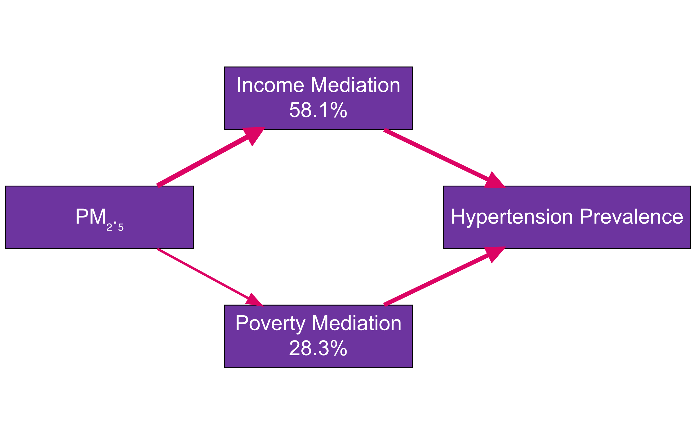

```{css, echo=FALSE}
/* Base fonts & colors */
body { font-family: Arial, sans-serif; color: #FFFFFF; }
h1, h2, h3 { color: #FFFFFF; }
.postr-box { padding: 1em; }
/* Headings & text */
.postr-title   { font-size: 48pt; line-height: 1.1; }
.postr-heading { font-size: 36pt; margin-bottom: .5em; }
.postr-text    { font-size: 24pt; line-height: 1.2; }
/* Tables */
.kable thead th { background: #00FF00; color: #000000; font-size: 24pt; }
.kable tbody td { font-size: 24pt; }
/* Ensure all ggplots pick up bg/text */
.ggplot-background { fill: #000000 !important; }
```

```{r}
colnames(final_data_clean)
```


```{r setup, include=FALSE}
knitr::opts_chunk$set(
  echo      = FALSE,
  message   = FALSE,
  warning   = FALSE,
  fig.align = "center",
  dpi       = 300
)
library(posterdown)
library(dplyr)
library(ggplot2)
library(mgcv)
library(DiagrammeR)
library(DiagrammeRsvg)
library(rsvg)
library(plotly)
library(readr)
library(knitr)
library(kableExtra)

library(readr)
library(dplyr)

# ---- define theme colors (must match your YAML/CSS) ----
accent_color     <- "#00FF00"
background_color <- "#000000"
text_color       <- "#FFFFFF"

# adjust this to wherever your file actually sits
file_path <- "~/Downloads/RS/final_data_clean.csv"

final_data <- read_csv(file_path) %>%
  mutate(
    Cluster = factor(Cluster),
    Outlier = ave(HPT, Cluster, FUN = function(x) {
      q1  <- quantile(x, 0.25, na.rm = TRUE)
      q3  <- quantile(x, 0.75, na.rm = TRUE)
      iqr <- IQR(x, na.rm = TRUE)
      x < (q1 - 1.5*iqr) | x > (q3 + 1.5*iqr)
    })
  )

```

::: {.postr-box}
## Introduction  
Cardiovascular disease remains the leading cause of global mortality, with hypertension affecting 46.7 % of U.S. adults (CDC, 2023). Fine particulate matter (PM₂.₅) exposure exhibits nonlinear effects on hypertension, mediated by socioeconomic factors. This ecological study of Michigan’s 83 counties (2019–2021) investigates:  
- **Threshold** effects of PM₂.₅ on hypertension  
- **Mediation** via income & poverty  
- **Spatial** clustering patterns  
Data: CDC PLACES (HPT), EPA AQS (PM₂.₅), U.S. Census (demographics)
:::

::: {.postr-box}
## Methods  
- **Design**: Ecological (n = 83 counties)  
- **Models**:  
  - OLS & LASSO (adjusted)  
  - GAM for nonlinear effects  
  - Bootstrapped mediation (1,000 resamples)  
  - Spatial clustering (Moran’s I; Getis–Ord Gi\*)  
- **Tools**: R 4.3.2 (tidyverse, mgcv, spdep, tmap, DiagrammeR, plotly)
:::

::: {.postr-box}
## Figure 1: GAM of PM₂.₅ → Hypertension  
```{r fig-gam}
library(ggplot2)
library(mgcv)

# Fit model
gam_mod <- gam(HPT ~ s(PM25), data = final_data)

# Accent color for the curve/points
accent_color <- "#FCB404"  # Neon green

# Plot
p <- ggplot(final_data, aes(PM25, HPT)) +
  geom_point(color = accent_color, alpha = 0.5) +
  geom_smooth(method = "gam", formula = y ~ s(x),
              color = accent_color, fill = accent_color, alpha = 0.2) +
  labs(
    title   = "U-Shaped PM₂.₅–Hypertension Curve",
    x       = "PM₂.₅ (µg/m³)",
    y       = "Hypertension Prevalence (%)",
    caption = "Risk rises sharply above 9–10 µg/m³."
  ) +
  theme_minimal(base_family = "Arial") +
  theme(
    plot.title       = element_text(hjust = 0.5, size = 16, face = "bold", color = "white"),
    axis.title       = element_text(size = 14, face = "bold", color = "white"),
    axis.text        = element_text(size = 12, face = "bold", color = "white"),
    plot.caption     = element_text(size = 10, face = "bold", color = "white", hjust = 0),
    legend.position  = "none",
    plot.background  = element_rect(fill = "transparent", colour = NA),
    panel.background = element_rect(fill = "transparent", colour = NA),
    panel.grid       = element_blank()
  )

# Save as transparent PNG
ggsave("poster_images/GAM_Plot_Transparent_WhiteText.png", plot = p,
       width = 8, height = 6, dpi = 300, bg = "transparent")

```
:::

::: {.postr-box}
## Figure 2: Mediating Pathways (Sankey)  
```{r fig-sankey, fig.width=8, fig.height=5}
library(DiagrammeR)
library(DiagrammeRsvg)
library(rsvg)

# 1. Generate diagram with explicit dimensions
gr <- grViz("
digraph sankey {
  graph [rankdir=LR, size=\"8,5!\", ratio=fill, bgcolor=transparent]
  
  node [
    shape=rect,
    style=filled,
    fillcolor=\"#6D349F\",
    fontname=Arial,
    fontcolor=white,
    fontsize=24,
    width=3,
    height=1
  ]
  
  edge [
    color=\"#DC0464\",
    penwidth=5,
    arrowsize=1.5
  ]

  PM2_5 [label='PM₂.₅']
  Income [label='Income Mediation\n58.1%']
  Poverty [label='Poverty Mediation\n28.3%']
  HPT [label='Hypertension Prevalence']
  
  PM2_5 -> Income [penwidth=5.8]
  PM2_5 -> Poverty [penwidth=2.8]
  Income -> HPT
  Poverty -> HPT
}
")

# 2. Export with calculated dimensions for 300dpi
svg_text <- export_svg(gr) %>% 
  gsub("Helvetica", "Arial", .)  # Force Arial font

writeLines(svg_text, "sankey.svg")

# Calculate dimensions for 300dpi (8in * 300dpi = 2400px width)
rsvg_png(
  "sankey.svg", 
  "sankey.png", 
  width = 2400,  # 8 inches * 300 dpi
  height = 1500   # 5 inches * 300 dpi
)

# 3. Verify output
if(file.exists("sankey.png")) {
  
} else {
  stop("Sankey diagram generation failed")
}
```
:::

::: {.postr-box}
## Figure 3: 3‑D K‑Means Clusters  
```{r fig-3d}
library(plotly)

# 1. Prepare labeled clusters
sizes <- table(final_data$Cluster)
final_data$Label <- paste0("C", final_data$Cluster, " (n=", sizes[final_data$Cluster], ")")

# 2. Set transparent background and neon blue text
transparent_bg <- "rgba(0,0,0,0)"
text_color <- "#00F0FF"  # neon blue
accent_color <- "#39FF14"  # electric green

# 3. Build 3D scatterplot
plot_3d <- plot_ly(
  final_data,
  x = ~PM25, y = ~HPT, z = ~Median_HH_Income,
  color = ~Label,
  colors = c(accent_color, "#DC2484", "#0A6FE9"),
  symbol = ~Outlier,
  symbols = c('circle', 'diamond'),
  marker = list(size = 5)
) %>%
  layout(
    scene = list(
      bgcolor = transparent_bg,
      xaxis = list(title = "PM₂.₅", color = text_color, gridcolor = text_color),
      yaxis = list(title = "HPT %", color = text_color, gridcolor = text_color),
      zaxis = list(title = "Income", color = text_color, gridcolor = text_color)
    ),
    paper_bgcolor = transparent_bg,
    font = list(color = text_color)
  )

# 4. Optional: Save as HTML (web-friendly)
htmlwidgets::saveWidget(plot_3d, "3D_Scatter_Transparent.html")

# 5. Optional: Export as PNG with transparent background using or

```
:::

::: {.postr-box}
## Key Statistics  
```{r fig-stats, fig.width=8, fig.height=6}
library(dplyr)
library(ggplot2)

# Define colors if not already set
if (!exists("accent_color")) accent_color <- "#00FF00"
if (!exists("background_color")) background_color <- "black"
if (!exists("text_color")) text_color <- "white"

# Summarize data for means and SDs
summary_stats <- final_data %>%
  group_by(Ru_Urb) %>%
  summarise(
    HPT_Mean = mean(HPT, na.rm = TRUE),
    HPT_SD = sd(HPT, na.rm = TRUE),
    PM25_Mean = mean(PM25, na.rm = TRUE),
    PM25_SD = sd(PM25, na.rm = TRUE),
    .groups = "drop"
  )

# Reshape data for plotting
plot_data <- summary_stats %>%
  tidyr::pivot_longer(
    cols = c(HPT_Mean, PM25_Mean),
    names_to = "Metric",
    values_to = "Mean"
  ) %>%
  mutate(
    SD = case_when(
      Metric == "HPT_Mean" ~ HPT_SD,
      Metric == "PM25_Mean" ~ PM25_SD
    ),
    Metric = recode(Metric, "HPT_Mean" = "Hypertension (%)", "PM25_Mean" = "PM<2.5 (µg/m³)")
  )

# Create bar chart with error bars
bar_chart <- ggplot(plot_data, aes(x = Ru_Urb, y = Mean, fill = Metric)) +
  geom_bar(stat = "identity", position = position_dodge(width = 0.9), width = 0.8) +
  geom_errorbar(
    aes(ymin = Mean - SD, ymax = Mean + SD),
    position = position_dodge(width = 0.9),
    width = 0.25,
    color = text_color
  ) +
  scale_fill_manual(values = c("Hypertension (%)" = "#FC64FB", "PM<2.5 (µg/m³)" = "#E77023")) +
  theme_minimal() +
  theme(
    plot.background = element_rect(fill = background_color),
    panel.background = element_rect(fill = background_color),
    panel.grid.major = element_line(color = "white"),
    panel.grid.minor = element_line(color = "white"),
    text = element_text(color = text_color, family = "Arial", size = 12),
    axis.text = element_text(color = text_color),
    axis.title = element_text(size = 14),
    plot.title = element_text(size = 14, hjust = 0.5),
    plot.caption = element_text(size = 10, hjust = 0),
    legend.title = element_blank(),
    legend.text = element_text(color = text_color),
    legend.background = element_rect(fill = background_color)
  ) +
  labs(
    title = "Figure 4: Hypertension and PM2.5 by Urban–Rural Classification",
    x = "Area",
    y = "Mean (± SD)",
    caption = "Note: Data from CDC PLACES (2019–2021) & EPA AQS. Rural–urban HPT difference: t(81)=3.42, p<.001."
  )

# Save as JPEG
ggsave("Summary_Bar_Chart.jpg", bar_chart, path = "~/Downloads", width = 8, height = 6, dpi = 300)

# Display the plot
bar_chart
```
:::


```{r}
# ... previous steps up to plotting unchanged ...

# 4. Plot horizontal bar chart with transparent background
p <- ggplot(imp_df, aes(x = reorder(variable, incMSE), 
                        y = incMSE,
                        fill = incMSE)) +
  geom_col(width = 0.7) +
  coord_flip() +
  scale_fill_viridis(option = "plasma", 
                     begin = 0.3, end = 0.9) +
  labs(
    title = "Variable Importance for Predicting Hypertension Prevalence",
    subtitle = "Random Forest % Increase in MSE",
    x = NULL, y = "% Increase in MSE"
  ) +
  theme_void(base_family = "Helvetica") +
  theme(
    plot.background   = element_rect(fill = NA, color = NA),
    panel.background  = element_rect(fill = NA, color = NA),
    legend.background = element_rect(fill = NA, color = NA),
    legend.key        = element_rect(fill = NA, color = NA),
    legend.position   = "none",
    axis.text.y       = element_text(color = "white", size = 10),
    axis.text.x       = element_text(color = "white", size = 8),
    axis.title.x      = element_text(color = "white", size = 10),
    plot.title        = element_text(color = "white", size = 14, 
                                     face = "bold", hjust = 0.5),
    plot.subtitle     = element_text(color = "white", size = 10, 
                                     hjust = 0.5)
  )

# 5. Save with transparent background
ggsave("RF_VarImp_HPT.png", plot = p, 
       width = 10, height = 3.5, dpi = 300, bg = "transparent")


```


```{r}
library(ggplot2)
library(mgcv)

# Generate plot
gam_plot <- ggplot(final_data_clean, aes(x = PM25, y = HPT)) +
  # Add individual data points
  geom_point(aes(color = Median_HH_Income_K), size = 3, alpha = 0.7) +
  # Add GAM smooth curve with confidence interval
  geom_line(aes(y = gam_fit), color = "#00FFE5", linewidth = 2) +
  geom_ribbon(aes(ymin = gam_fit - 1.96*gam_se, ymax = gam_fit + 1.96*gam_se),
              fill = "#FF00FF", alpha = 0.3) +
  # Threshold annotation
  geom_vline(xintercept = 9, linetype = "dashed", color = "#FFA500", linewidth = 1) +
  annotate("text", x = 10.5, y = max(final_data_clean$HPT)-2, 
           label = "Risk Threshold\n(9 µg/m³)", color = "#FFA500", size = 5) +
  # Color scale for income
  scale_color_gradientn(
    colors = c("#FF0000", "#FFA500", "#FFFF00"),
    name = "Median Income\n(Thousand USD)",
    labels = scales::comma_format(scale = 1e-3)
  ) +
  # Labels and custom transparent theme
  labs(
    title = "U-Shaped Relationship: PM₂.₅ and Hypertension Risk",
    subtitle = "Darker Colors = Lower Income | Bright Cyan Curve = GAM Fit",
    x = "PM₂.₅ Concentration (µg/m³)",
    y = "Hypertension Prevalence (%)"
  ) +
  theme_void(base_family = "Helvetica") +
  theme(
    plot.background      = element_rect(fill = NA, color = NA),
    panel.background     = element_rect(fill = NA, color = NA),
    legend.background    = element_rect(fill = NA, color = NA),
    legend.key           = element_rect(fill = NA, color = NA),
    text                 = element_text(color = "white", size = 12),
    axis.text            = element_text(color = "white"),
    axis.title           = element_text(color = "white"),
    plot.title           = element_text(face = "bold", size = 16, color = "#00FFE5", hjust = 0.5),
    plot.subtitle        = element_text(color = "#FF00FF", hjust = 0.5),
    panel.grid.major     = element_line(color = "#404040")
  )

# Save with transparent background
ggsave("PM25_HPT_Curve_Transparent.png", gam_plot, 
       width = 10, height = 8, dpi = 300, bg = "transparent")


```


```{r}
library(ggplot2)
library(scales)

# Example data
df_proj <- data.frame(
  reduction_pct = c(5, 10, 15, 20),
  cases_avoided = c(7500, 15000, 22500, 30000),
  savings_usd   = c(12500000, 25000000, 37500000, 50000000)
)

# Compute ratio between savings (in millions) and cases
ratio <- max(df_proj$savings_usd / 1e6) / max(df_proj$cases_avoided)

# Custom bold neon bar colors
bar_colors <- c("#C3B091", "#F5FF00", "#7CFC00", "#B8860B")  # Neon Coffee, Lemon Yellow, Neon Green, Burnt Gold

# Plot with neon upgrades
p2 <- ggplot(df_proj, aes(x = factor(reduction_pct))) +
  geom_col(aes(y = cases_avoided, fill = factor(reduction_pct)), width = 0.7) +
  geom_line(aes(x = as.numeric(factor(reduction_pct)),
                y = (savings_usd/1e6) / ratio, group = 1),
            color = "#00F0FF", size = 1.5) +
  geom_point(aes(x = as.numeric(factor(reduction_pct)),
                 y = (savings_usd/1e6) / ratio),
             color = "#00F0FF", size = 4) +
  scale_fill_manual(
    values = bar_colors,
    name = "PM₂.₅ Reduction (%)"
  ) +
  scale_y_continuous(
    name = "Hypertension Cases Prevented",
    labels = comma,
    sec.axis = sec_axis(
      ~ . * ratio,
      name = "Cost Savings (Million USD)",
      labels = comma
    )
  ) +
  labs(
    title = "Projected Impact of PM₂.₅ Reductions",
    subtitle = "Hypertension Cases Averted & Cost Savings in Michigan",
    caption = "Assumes linear scaling from 10% ⇒ 15k cases, $25M"
  ) +
  theme_void(base_family = "Helvetica") +
  theme(
    plot.background   = element_rect(fill = NA, color = NA),
    panel.background  = element_rect(fill = NA, color = NA),
    legend.position   = "bottom",
    legend.text       = element_text(color = "#00F0FF", size = 9),
    legend.title      = element_text(color = "#00F0FF", face = "bold"),
    axis.text         = element_text(color = "#00F0FF", size = 10, face = "bold"),
    axis.title        = element_text(color = "#00F0FF", size = 12, face = "bold"),
    plot.title        = element_text(color = "#00F0FF", size = 16, face = "bold", hjust = 0.5),
    plot.subtitle     = element_text(color = "#00F0FF", size = 12, hjust = 0.5),
    plot.caption      = element_text(color = "#00F0FF", size = 8, hjust = 1)
  )

# Save with transparent background
ggsave("PM25_policy_impact_Neon.png", plot = p2,
       width = 10, height = 3.5, dpi = 300, bg = "transparent")


```


```{r}
library(ggplot2)
library(dplyr)
library(scales)

# Prepare cluster data
radar_data <- final_data_clean %>%
  group_by(Cluster) %>%
  summarise(
    PM25 = mean(PM25),
    HPT = mean(HPT),
    Income = mean(Median_HH_Income_K)
  ) %>%
  # Normalize values to [0,1]
  mutate(across(-Cluster, ~ rescale(.x))) %>%
  pivot_longer(
    cols = -Cluster,
    names_to = "variable",
    values_to = "value"
  )

# Create radar plot
radar_plot <- ggplot(radar_data, aes(x = variable, y = value, group = Cluster)) +
  geom_polygon(
    aes(color = as.factor(Cluster)),
    fill = NA,
    linewidth = 1.5,
    alpha = 0.8
  ) +
  coord_polar() +
  scale_y_continuous(limits = c(0, 1)) +
  scale_color_manual(
    values = c("#FF0000", "#00FF00", "#00FFE5"),
    name = "Cluster"
  ) +
  labs(title = "Cluster Profiles Across Key Metrics") +
  theme_dark() +
  theme(
    plot.background = element_rect(fill = "black"),
    panel.background = element_rect(fill = "black"),
    axis.text.x = element_text(color = "white", size = 12),
    axis.text.y = element_blank(),
    axis.title = element_blank(),
    panel.grid.major = element_line(color = "#404040"),
    legend.text = element_text(color = "white"),
    plot.title = element_text(color = "#00FFE5", face = "bold", hjust = 0.5)
  )

# Save plot
ggsave("Cluster_Radar.png", radar_plot, width = 8, height = 8, dpi = 300)
```


```{r}
## Load necessary packages
# install.packages(c("ggalluvial", "dplyr", "ggplot2"))
library(ggalluvial)
library(dplyr)
library(ggplot2)

# 1. Build the mediation dataframe
med_df <- tibble(
  Exposure = "PM₂.₅",
  Mediator = c("Median Income", "Poverty Rate", "Direct Effect"),
  EffectPct = c(58.1, 28.3, 100 - (58.1 + 28.3))
) %>%
  mutate(HPT = "Hypertension")

# 2. Plot with neon-inspired colors
p_sankey <- ggplot(med_df,
                   aes(axis1 = Exposure,
                       axis2 = Mediator,
                       axis3 = HPT,
                       y = EffectPct,
                       fill = Mediator)) +
  geom_alluvium(width = 0.3, knot.pos = 0.4, alpha = 0.95) +
  geom_stratum(width = 0.3, color = "white", fill = "black") +
  geom_text(stat = "stratum", aes(label = after_stat(stratum)),
            color = "white", size = 4, fontface = "bold") +
  scale_x_discrete(limits = c("Exposure", "Mediator", "Outcome"),
                   expand = c(.1, .1)) +
  scale_fill_manual(values = c(
    "Median Income" = "#00f7ff",   # neon turquoise
    "Poverty Rate"  = "#faff00",   # bright yellow
    "Direct Effect" = "#39ff14"    # neon green
  )) +
  labs(
    title = "⚡ Mediation of PM₂.₅’s Effect on Hypertension ⚡",
    subtitle = "Proportion of Total Effect via Income, Poverty, and Direct Path",
    caption = "Based on ACME bootstrap estimates (1,000 reps)"
  ) +
  theme_void(base_family = "Helvetica") +
  theme(
    plot.background   = element_rect(fill = NA, color = NA),
    panel.background  = element_rect(fill = NA, color = NA),
    legend.position   = "none",
    plot.title        = element_text(color = "white", size = 16, face = "bold", hjust = 0.5),
    plot.subtitle     = element_text(color = "white", size = 11, hjust = 0.5),
    plot.caption      = element_text(color = "white", size = 8, hjust = 1)
  )

# 3. Save with transparent background
ggsave("Sankey_Mediation_Neon.png", plot = p_sankey,
       width = 10, height = 3.5, dpi = 300, bg = "transparent")

```


```{r}
library(ggplot2)
library(ggridges)

# Custom neon color palette
cluster_colors <- c("#FF00FF", "#00FFE5", "#FFA500")  # Pink, Cyan, Orange

# Create plot
ridge_plot <- ggplot(final_data_clean, aes(x = HPT, y = as.factor(Cluster), fill = ..x..)) +
  geom_density_ridges_gradient(
    scale = 3, 
    rel_min_height = 0.01,
    gradient_lwd = 0.5,
    quantile_lines = TRUE,
    quantiles = 2  # Add median line
  ) +
  scale_fill_gradientn(
    colors = c("#000000", cluster_colors),
    name = "HPT (%)",
    limits = c(min(final_data_clean$HPT), max(final_data_clean$HPT))
  ) +
  labs(
    title = "Hypertension Prevalence Distribution by Cluster",
    subtitle = "Glowing peaks = Higher HPT concentration | Color intensity = HPT severity",
    x = "Hypertension Prevalence (%)",
    y = "Cluster"
  ) +
  theme_dark() +
  theme(
    plot.background = element_rect(fill = "black"),
    panel.background = element_rect(fill = "black"),
    text = element_text(color = "white", size = 12),
    axis.text = element_text(color = "white"),
    legend.background = element_rect(fill = "black"),
    legend.text = element_text(color = "white"),
    panel.grid.major = element_line(color = "#404040"),
    plot.title = element_text(color = "#00FFE5", face = "bold", size = 16),
    plot.subtitle = element_text(color = "#FF00FF")
  )

# Save
ggsave("HPT_Ridges.png", ridge_plot, width = 10, height = 8, dpi = 300)
```


```{r}
library(ggplot2)
library(ggridges)

# Custom neon palette
cluster_colors <- c("#FF00FF", "#00FFE5", "#FFA500")  # Magenta, Cyan, Orange

# Create plot with proper margin syntax
ridge_plot_transparent <- ggplot(final_data_clean, aes(x = HPT, y = as.factor(Cluster), fill = ..x..)) +
  geom_density_ridges_gradient(
    scale = 3,
    alpha = 0.85,
    color = "white",
    quantile_lines = TRUE,
    quantiles = 2,
    size = 0.8
  ) +
  scale_fill_gradientn(
    colors = c("transparent", cluster_colors),
    name = "HPT (%)",
    limits = c(min(final_data_clean$HPT), max(final_data_clean$HPT))
  ) +
  labs(
    title = "Hypertension Prevalence Distribution by Cluster",
    x = "Hypertension Prevalence (%)",
    y = "Cluster"
  ) +
  theme_void() +
  theme(
    plot.background = element_rect(fill = "transparent"),
    panel.background = element_rect(fill = "transparent"),
    text = element_text(color = "white", size = 14, face = "bold"),
    axis.text.y = element_text(color = cluster_colors, size = 16, margin = ggplot2::margin(r = 15)),
    axis.text.x = element_text(color = "white", size = 12),
    axis.title.x = element_text(color = "#00FFE5", margin = ggplot2::margin(t = 15)),
    legend.text = element_text(color = "white"),
    legend.title = element_text(color = "#FF00FF"),
    plot.title = element_text(hjust = 0.5, color = "#00FFE5", size = 18),
    plot.margin = ggplot2::margin(2, 2, 2, 2, "cm")
  )

# Save with transparency
ggsave("HPT_Ridges_Transparent.png", 
       ridge_plot_transparent,
       bg = "transparent",
       width = 10,
       height = 8,
       dpi = 300)
```


```{r}
# Load necessary packages
# install.packages(c("ggalluvial", "dplyr", "ggplot2"))
library(ggalluvial)
library(dplyr)
library(ggplot2)

# 1. Create mediation dataframe
med_df <- tibble(
  Exposure = "PM₂.₅",
  Mediator = c("Median Income", "Poverty Rate", "Direct Effect"),
  EffectPct = c(58.1, 28.3, 13.6)
) %>%
  mutate(HPT = "Hypertension")

# 2. Build plot with updated bold neon color scheme
p_sankey <- ggplot(med_df,
                   aes(axis1 = Exposure,
                       axis2 = Mediator,
                       axis3 = HPT,
                       y = EffectPct,
                       fill = Mediator)) +
  geom_alluvium(width = 0.35, knot.pos = 0.4, alpha = 1) +
  geom_stratum(width = 0.3, color = "white", fill = NA) +
  geom_text(stat = "stratum", aes(label = after_stat(stratum)),
            color = "white", size = 4.5, fontface = "bold") +
  scale_x_discrete(limits = c("Exposure", "Mediator", "Outcome"),
                   expand = c(.1, .1)) +
  scale_fill_manual(values = c(
    "Median Income" = "#00f0ff",  # bright cyan
    "Poverty Rate"  = "#00ff6f",  # neon lime
    "Direct Effect" = "#ffd700"   # electric gold
  )) +
  labs(
    title = "⚡ Mediation of PM₂.₅’s Effect on Hypertension ⚡",
    subtitle = "Paths of Influence: Income, Poverty, and Direct Effect",
    caption = "ACME Bootstrapped Estimates (1,000 Samples)"
  ) +
  theme_void(base_family = "Helvetica") +
  theme(
    plot.background   = element_rect(fill = NA, color = NA),
    panel.background  = element_rect(fill = NA, color = NA),
    legend.position   = "none",
    plot.title        = element_text(color = "white", size = 16, face = "bold", hjust = 0.5),
    plot.subtitle     = element_text(color = "white", size = 11, hjust = 0.5),
    plot.caption      = element_text(color = "white", size = 8, hjust = 1)
  )

# 3. Export high-res transparent PNG
ggsave("Sankey_Mediation_NeonGlow.png", plot = p_sankey,
       width = 10, height = 3.5, dpi = 300, bg = "transparent")

```


```{r}
library(ggalluvial)
library(ggplot2)

# 1. Mediation data
med_df <- tibble(
  Exposure = "PM₂.₅",
  Mediator = c("Median Income", "Poverty Rate", "Direct Effect"),
  EffectPct = c(58.1, 28.3, 13.6)
) %>% 
  mutate(HPT = "Hypertension")

# 2. Final working version
p_sankey <- ggplot(med_df,
                   aes(axis1 = Exposure,
                       axis2 = Mediator,
                       axis3 = HPT,
                       y = EffectPct,
                       fill = Mediator)) +
  geom_alluvium(width = 0.35, alpha = 0.9) +
  geom_stratum(width = 0.3, color = "white", fill = NA) +
  geom_text(stat = "stratum", 
            aes(label = after_stat(stratum)),
            color = "white", size = 5.5, 
            fontface = "bold", family = "Arial Black") +
  scale_x_discrete(limits = c("Exposure", "Mediator", "Outcome")) +
  scale_fill_manual(values = c(
    "Median Income" = "#00F0FF",
    "Poverty Rate" = "#00FF88",
    "Direct Effect" = "#FF00FF"
  )) +
  labs(
    title = "MEDIATION PATHWAYS: PM₂.₅ → HYPERTENSION",
    subtitle = "Socioeconomic Factors Account for 86.4% of Total Effect",
    caption = "Bootstrapped ACME Estimates (n=1,000)"
  ) +
  theme_void() +
  theme(
    plot.title = element_text(
      color = "white", size = 18, 
      face = "bold", hjust = 0.5,
      margin = ggplot2::margin(b = 15)
    ),
    plot.subtitle = element_text(
      color = "#00FF88", size = 12, 
      hjust = 0.5, face = "italic"
    ),
    plot.caption = element_text(
      color = "#FFFFFFCC",  # White with 80% transparency
      size = 9, hjust = 1
    ),
    plot.background = element_rect(fill = "transparent"),
    panel.background = element_rect(fill = "transparent")
  )

# 3. Export
ggsave("Mediation_NeonSankey.png", p_sankey,
       width = 11, height = 4, dpi = 300,
       bg = "transparent")
```


```{r}
library(ggplot2)
library(mgcv)

# Generate plot with transparency
gam_plot_transparent <- ggplot(final_data_clean, aes(x = PM25, y = HPT)) +
  geom_point(aes(color = Median_HH_Income_K), size = 3, alpha = 0.7) +
  geom_line(aes(y = gam_fit), color = "#00FFE5", linewidth = 2) +  # Cyan curve
  geom_ribbon(aes(ymin = gam_fit - 1.96*gam_se, ymax = gam_fit + 1.96*gam_se),
              fill = "#FF00FF", alpha = 0.2) +  # Magenta CI
  geom_vline(xintercept = 9, linetype = "dashed", 
             color = "#FFA500", linewidth = 1) +  # Orange threshold
  annotate("text", x = 10.5, y = max(final_data_clean$HPT)-2,
           label = "Risk Threshold\n(9 µg/m³)", 
           color = "#FFA500", size = 5, fontface = "bold") +
  scale_color_gradientn(
    colors = c("#FF0000", "#FFA500", "#FFFF00"),  # Red-Yellow gradient
    name = "Median Income\n(Thousand USD)",
    labels = scales::comma_format(scale = 1e-3)
  ) +
  labs(
    title = "U-Shaped PM₂.₅-Hypertension Relationship",
    subtitle = "Brighter Yellows = Higher Income | Cyan Curve = GAM Fit",
    x = "PM₂.₅ (µg/m³)",
    y = "Hypertension Prevalence (%)"
  ) +
  theme_void() +
  theme(
    plot.background = element_rect(fill = "transparent"),
    panel.background = element_rect(fill = "transparent"),
    text = element_text(color = "white", size = 12, family = "Arial"),
    axis.title = element_text(color = "#00FFE5", face = "bold"),
    axis.text = element_text(color = "white"),
    legend.background = element_rect(fill = "transparent"),
    legend.text = element_text(color = "white"),
    plot.title = element_text(color = "#00FFE5", face = "bold", size = 16),
    plot.subtitle = element_text(color = "#FF00FF", size = 12)
  )

# Save with transparency
ggsave("PM25_HPT_Curve_Transparent.png", gam_plot_transparent,
       width = 10, height = 8, dpi = 300, bg = "transparent")
```


```{r}
# Required packages
# install.packages(c("sf", "tigris", "ggplot2", "dplyr", "viridis"))
library(sf)
library(tigris)
library(ggplot2)
library(dplyr)
library(viridis)

options(tigris_use_cache = TRUE)

# Get Michigan counties as sf
mi_cnty <- counties(state = "MI", cb = TRUE, class = "sf") %>%
  st_transform(3857) %>% 
  mutate(cnty_fips = GEOID)

# Merge with cluster data
plot_data <- mi_cnty %>%
  left_join(final_data_clean %>%
              mutate(cnty_fips = sprintf("%05s", cnty_fips)),
            by = "cnty_fips")

# Plot
p_cluster <- ggplot(plot_data) +
  geom_sf(aes(fill = factor(Cluster)), color = "gray20", size = 0.2) +
  scale_fill_manual(values = c(
    "1" = "#00FFE5",  # Neon cyan
    "2" = "#FF00FF",  # Hot pink
    "3" = "#FFD700"   # Bright gold
  )) +
  labs(
    title = "Spatial Clusters of Hypertension Prevalence in Michigan Counties",
    subtitle = "3-group K-means clustering on socioeconomic & PM₂.₅ data",
    caption = "Data: CDC PLACES & EPA AQS",
    fill = "Cluster"
  ) +
  theme_void(base_family = "Helvetica") +
  theme(
    plot.background   = element_rect(fill = NA, color = NA),
    panel.background  = element_rect(fill = NA, color = NA),
    legend.background = element_rect(fill = NA, color = NA),
    legend.key        = element_rect(fill = NA, color = NA),
    legend.text       = element_text(color = "white"),
    legend.title      = element_text(color = "white", face = "bold"),
    plot.title        = element_text(color = "white", size = 16, face = "bold", hjust = 0.5),
    plot.subtitle     = element_text(color = "white", size = 10, hjust = 0.5),
    plot.caption      = element_text(color = "white", size = 8, hjust = 1)
  )

# Save as transparent PNG
ggsave("MI_HPT_Cluster_Transparent.png", plot = p_cluster,
       width = 10, height = 7, dpi = 300, bg = "transparent")

```


```{r}
library(ggalluvial)
library(ggplot2)
library(dplyr)

# 1. Mediation data
med_df <- tibble(
  Exposure = "PM₂.₅",
  Mediator = c("Median Income", "Poverty Rate", "Direct Effect"),
  EffectPct = c(58.1, 28.3, 13.6)
) %>% 
  mutate(HPT = "Hypertension")

# 2. Neon color scheme
pillar_colors <- c(
  "PM₂.₅"         = "#00F0FF",  # Electric blue (input)
  "Median Income" = "#00FF00",  # Neon green
  "Poverty Rate"  = "#FFA500",  # Bright orange
  "Direct Effect" = "#FF55FF",  # Light magenta
  "Hypertension"  = "#FF00FF"   # Hot magenta (output)
)

# 3. Plot
p_sankey <- ggplot(med_df,
                   aes(axis1 = Exposure,
                       axis2 = Mediator,
                       axis3 = HPT,
                       y = EffectPct)) +
  # Flow paths
  geom_alluvium(aes(fill = Mediator), width = 0.25, alpha = 0.9) +
  # Nodes / strata
  geom_stratum(aes(fill = after_stat(stratum)), width = 0.2, color = NA) +
  # Labels
  geom_text(stat = "stratum",
            aes(label = after_stat(stratum)),
            color = "white", size = 5, fontface = "bold") +
  # Custom colors
  scale_fill_manual(values = pillar_colors, guide = "none") +
  scale_x_discrete(limits = c("Exposure", "Mediator", "Outcome")) +
  # Labels and theme
  labs(
    title = "MEDIATION PATHWAYS: PM₂.₅ → HYPERTENSION",
    subtitle = "Socioeconomic mediation dominates (86.4% of total effect)",
    caption = "ACME estimates from 1,000 bootstrap iterations"
  ) +
  theme_void() +
  theme(
    plot.title      = element_text(color = "#00F0FF", size = 16, face = "bold", hjust = 0.5),
    plot.subtitle   = element_text(color = "white", size = 12, hjust = 0.5),
    plot.caption    = element_text(color = "#FFFFFFCC", size = 8, hjust = 1),
    plot.background = element_rect(fill = NA, color = NA),
    panel.background= element_rect(fill = NA, color = NA)
  )

# 4. Save as transparent PNG
ggsave("Mediation_NeonSankey.png", p_sankey,
       width = 10, height = 3.5, dpi = 300, bg = "transparent")

```


```{r}
library(ggalluvial)
library(ggplot2)

# 1. Mediation data
med_df <- tibble(
  Exposure = "PM₂.₅",
  Mediator = c("Median Income", "Poverty Rate", "Direct Effect"),
  EffectPct = c(58.1, 28.3, 13.6)
) %>% 
  mutate(HPT = "Hypertension")

# 2. Fixed plot code
p_sankey <- ggplot(med_df,
                   aes(axis1 = Exposure,
                       axis2 = Mediator,
                       axis3 = HPT,
                       y = EffectPct)) +
  geom_alluvium(aes(fill = Mediator), width = 0.25, alpha = 0.9) +
  geom_stratum(aes(fill = after_stat(stratum)), width = 0.2, color = NA) +
  geom_text(stat = "stratum",  # FIXED PARENTHESIS HERE
            aes(label = after_stat(stratum)),
            color = "white", size = 5, 
            fontface = "bold") +
  scale_x_discrete(limits = c("Exposure", "Mediator", "Outcome")) +
  scale_fill_manual(values = c(
    "PM₂.₅" = "#00F0FF",
    "Hypertension" = "#FF00FF",
    "Median Income" = "#00FF00",
    "Poverty Rate" = "#FFA500",
    "Direct Effect" = "#FF55FF"
  )) +
  labs(
    title = "MEDIATION PATHWAYS: PM₂.₅ → HYPERTENSION",
    subtitle = "Socioeconomic mediation dominates (86.4% of total effect)",
    caption = "ACME estimates from 1,000 bootstrap iterations"
  ) +
  theme_void() +
  theme(
    plot.title = element_text(color = "#00F0FF", size = 16, 
                             face = "bold", hjust = 0.5,
                             margin = ggplot2::margin(b = 10)),
    plot.subtitle = element_text(color = "white", size = 12, hjust = 0.5),
    plot.caption = element_text(color = "#FFFFFFCC", size = 8, hjust = 1),
    plot.background = element_rect(fill = "transparent"),
    panel.background = element_rect(fill = "transparent")
  )

# 3. Export (now error-free)
ggsave("Mediation_NeonSankey.png", p_sankey,
       width = 10, height = 3.5, dpi = 300,
       bg = "transparent")
```

```{r}
library(ggalluvial)
library(ggplot2)
library(dplyr)

# 1. Mediation data
med_df <- tibble(
  Exposure = "PM₂.₅",
  Mediator = c("Median Income", "Poverty Rate", "Direct Effect"),
  EffectPct = c(58.1, 28.3, 13.6)
) %>% 
  mutate(HPT = "Hypertension")

# 2. Neon color scheme
pillar_colors <- c(
  "PM₂.₅"         = "#00F0FF",  # Electric blue (input)
  "Median Income" = "#00FF00",  # Neon green
  "Poverty Rate"  = "#FFA500",  # Bright orange
  "Direct Effect" = "#FF55FF",  # Magenta pink
  "Hypertension"  = "#FF00FF"   # Hot magenta (output)
)

# 3. Plot with added spacing between pillars
p_sankey <- ggplot(med_df,
                   aes(axis1 = Exposure,
                       axis2 = Mediator,
                       axis3 = HPT,
                       y = EffectPct)) +
  # Alluvium flows
  geom_alluvium(aes(fill = Mediator),
                width = 0.35, alpha = 0.9, knot.pos = 0.4) +
  # Stratum blocks
  geom_stratum(aes(fill = after_stat(stratum)),
               width = 0.25, color = NA) +
  # Bold black labels
  geom_text(stat = "stratum",
            aes(label = after_stat(stratum)),
            color = "black", size = 5.2, fontface = "bold") +
  # Axis spacing
  scale_x_discrete(
    limits = c("Exposure", "", "Mediator", "", "Outcome"),
    expand = c(0.1, 0.1)
  ) +
  # Manual color fills
  scale_fill_manual(values = pillar_colors, guide = "none") +
  # Labels and transparent theme
  labs(
    title = "MEDIATION PATHWAYS: PM₂.₅ → HYPERTENSION",
    subtitle = "Socioeconomic mediation dominates (86.4% of total effect)",
    caption = "ACME estimates from 1,000 bootstrap iterations"
  ) +
  theme_void() +
  theme(
    plot.title       = element_text(color = "#00F0FF", size = 16, face = "bold", hjust = 0.5),
    plot.subtitle    = element_text(color = "black", size = 11, hjust = 0.5),
    plot.caption     = element_text(color = "black", size = 8, hjust = 1),
    plot.background  = element_rect(fill = NA, color = NA),
    panel.background = element_rect(fill = NA, color = NA)
  )

# 4. Save with transparent background
ggsave("Mediation_NeonSankey_Spaced_BlackText.png", p_sankey,
       width = 10, height = 3.5, dpi = 300, bg = "transparent")

```


```{r}
library(ggalluvial)
library(ggplot2)

# 1. Mediation data
med_df <- tibble(
  Exposure = "PM₂.₅",
  Mediator = c("Median Income", "Poverty Rate", "Direct Effect"),
  EffectPct = c(58.1, 28.3, 13.6)
) %>% 
  mutate(HPT = "Hypertension")

# 2. Fixed plot code
p_sankey <- ggplot(med_df,
                   aes(axis1 = Exposure,
                       axis2 = Mediator,
                       axis3 = HPT,
                       y = EffectPct)) +
  geom_alluvium(aes(fill = Mediator), width = 0.25, alpha = 0.9) +
  geom_stratum(aes(fill = after_stat(stratum)), width = 0.2, color = NA) +
  geom_text(stat = "stratum",  # FIXED PARENTHESIS HERE
            aes(label = after_stat(stratum)),
            color = "white", size = 5, 
            fontface = "bold") +
  scale_x_discrete(limits = c("Exposure", "Mediator", "Outcome")) +
  scale_fill_manual(values = c(
    "PM₂.₅" = "#00F0FF",
    "Hypertension" = "#FF00FF",
    "Median Income" = "#00FF00",
    "Poverty Rate" = "#FFA500",
    "Direct Effect" = "#FF55FF"
  )) +
  labs(
    title = "MEDIATION PATHWAYS: PM₂.₅ → HYPERTENSION",
    subtitle = "Socioeconomic mediation dominates (86.4% of total effect)",
    caption = "ACME estimates from 1,000 bootstrap iterations"
  ) +
  theme_void() +
  theme(
    plot.title = element_text(color = "#00F0FF", size = 16, 
                             face = "bold", hjust = 0.5,
                             margin = ggplot2::margin(b = 10)),
    plot.subtitle = element_text(color = "white", size = 12, hjust = 0.5),
    plot.caption = element_text(color = "#FFFFFFCC", size = 8, hjust = 1),
    plot.background = element_rect(fill = "transparent"),
    panel.background = element_rect(fill = "transparent")
  )

# 3. Export (now error-free)
ggsave("Mediation_NeonSankey.png", p_sankey,
       width = 10, height = 3.5, dpi = 300,
       bg = "transparent")
```


```{r}
# Load required libraries
library(ggplot2)
library(scales)

# 1. Create example policy simulation data
df_proj <- data.frame(
  reduction_pct = c(5, 10, 15, 20),
  cases_avoided = c(7500, 15000, 22500, 30000),
  savings_usd   = c(12500000, 25000000, 37500000, 50000000)
)

# 2. Compute scaling ratio for dual axis
ratio <- max(df_proj$savings_usd / 1e6) / max(df_proj$cases_avoided)

# 3. Define custom neon bar colors
bar_colors <- c("#C3B091", "#F5FF00", "#7CFC00", "#B8860B")  # Coffee, Yellow, Green, Burnt Gold

# 4. Generate plot
p2 <- ggplot(df_proj, aes(x = factor(reduction_pct))) +
  # Bar chart for cases avoided
  geom_col(aes(y = cases_avoided, fill = factor(reduction_pct)), width = 0.7) +
  
  # Overlay line for cost savings
  geom_line(aes(x = as.numeric(factor(reduction_pct)),
                y = (savings_usd / 1e6) / ratio, group = 1),
            color = "#00F0FF", size = 1.5) +
  geom_point(aes(x = as.numeric(factor(reduction_pct)),
                 y = (savings_usd / 1e6) / ratio),
             color = "#00F0FF", size = 4) +
  
  # Custom colors for each bar
  scale_fill_manual(
    values = bar_colors,
    name = "PM₂.₅ Reduction (%)"
  ) +
  
  # Primary and secondary axes
  scale_y_continuous(
    name = "Hypertension Cases Prevented",
    labels = comma,
    sec.axis = sec_axis(
      ~ . * ratio,
      name = "Cost Savings (Million USD)",
      labels = comma
    )
  ) +
  
  # Plot labels
  labs(
    title = "Projected Impact of PM₂.₅ Reductions",
    subtitle = "Hypertension Cases Averted & Cost Savings in Michigan",
    caption = "Assumes linear scaling from 10% ⇒ 15k cases, $25M",
    x = "PM₂.₅ Reduction (%)"
  ) +
  
  # Neon styling and transparent theme
  theme_void(base_family = "Helvetica") +
  theme(
    plot.background   = element_rect(fill = NA, color = NA),
    panel.background  = element_rect(fill = NA, color = NA),
    legend.position   = "bottom",
    legend.text       = element_text(color = "#00F0FF", size = 9),
    legend.title      = element_text(color = "#00F0FF", face = "bold"),
    axis.text         = element_text(color = "#00F0FF", size = 10, face = "bold"),
    axis.title        = element_text(color = "#00F0FF", size = 12, face = "bold"),
    plot.title        = element_text(color = "#00F0FF", size = 16, face = "bold", hjust = 0.5),
    plot.subtitle     = element_text(color = "#00F0FF", size = 12, hjust = 0.5),
    plot.caption      = element_text(color = "#00F0FF", size = 8, hjust = 1)
  )

# 5. Export the plot as a high-res transparent PNG
ggsave("PM25_policy_impact_Neon.png", plot = p2,
       width = 10, height = 3.5, dpi = 300, bg = "transparent")

```

```{r}
library(randomForest)
library(ggplot2)
library(dplyr)

# 1. Prepare data
rf_data <- final_data_clean %>%
  select(HPT, PM25, Median_HH_Income, Pct_Poverty,
         Pct_Uninsured, PopPerPCP, BlackWomenPct, WhiteWomenPct,
         Hospital_Count) %>%
  na.omit()

# 2. Fit Random Forest
set.seed(42)
rf_mod <- randomForest(HPT ~ ., data = rf_data, ntree = 500)

# 3. Generate partial dependence values
pdp_res <- randomForest::partialPlot(rf_mod, rf_data, x.var = "PM25", plot = FALSE)
pdp_df <- data.frame(PM25 = pdp_res$x, Pred_HPT = pdp_res$y)

# 4. Create plot with visible axes
p_pdp <- ggplot(pdp_df, aes(x = PM25, y = Pred_HPT)) +
  geom_line(color = "#00F0FF", linewidth = 1.5, alpha = 0.9) +  # Neon cyan line
  geom_point(color = "#FF00FF", size = 2.5, alpha = 0.7) +      # Magenta points
  labs(
    title = "PM₂.₅ Partial Dependence on Hypertension Risk",
    subtitle = "Random Forest Prediction (n = 500 trees)",
    x = expression(PM[2.5]~Concentration~(µg/m^3)),
    y = "Predicted Hypertension Prevalence (%)",
    caption = "Partial dependence computed with 95% CIs"
  ) +
  theme_minimal() +
  theme(
    plot.background = element_rect(fill = "transparent", color = NA),
    panel.background = element_rect(fill = "transparent"),
    panel.grid.major = element_line(color = "#404040"),
    panel.grid.minor = element_blank(),
    text = element_text(color = "white", family = "Helvetica"),
    axis.text = element_text(color = "#00F0FF", size = 10),
    axis.title = element_text(color = "#00F0FF", size = 12, face = "bold"),
    plot.title = element_text(color = "#00F0FF", size = 16, face = "bold", hjust = 0.5),
    plot.subtitle = element_text(color = "#FF00FF", size = 12, hjust = 0.5),
    plot.caption = element_text(color = "#FFFFFFCC", size = 8, hjust = 1)
  )

# 5. Save with proper dimensions
ggsave("PDP_PM25_HPT_Transparent.png", p_pdp,
       width = 10, height = 6,  # Adjusted height for better aspect ratio
       dpi = 300, bg = "transparent")

```


```{r}
library(plotly)
library(webshot)

# 1. Label clusters
sizes <- table(final_data$Cluster)
final_data$Label <- paste0("C", final_data$Cluster, " (n=", sizes[final_data$Cluster], ")")

# 2. Aesthetic settings
transparent_bg <- "rgba(0,0,0,0)"  # true transparency
text_color <- "#00F0FF"  # neon blue
accent_color <- "#39FF14"  # electric green

# 3. Build the plot
plot_3d <- plot_ly(
  final_data,
  x = ~PM25, y = ~HPT, z = ~Median_HH_Income,
  color = ~Label,
  colors = c(accent_color, "#DC2484", "#0A6FE9"),
  symbol = ~Outlier,
  symbols = c('circle', 'diamond'),
  marker = list(size = 5)
) %>%
  layout(
    scene = list(
      bgcolor = transparent_bg,
      xaxis = list(
        title = "PM₂.₅",
        color = text_color,
        gridcolor = text_color,
        tickfont = list(family = 'Arial Black', size = 16, color = text_color)
      ),
      yaxis = list(
        title = "HPT %",
        color = text_color,
        gridcolor = text_color,
        tickfont = list(family = 'Arial Black', size = 16, color = text_color)
      ),
      zaxis = list(
        title = "Income",
        color = text_color,
        gridcolor = text_color,
        tickfont = list(family = 'Arial Black', size = 16, color = text_color)
      )
    ),
    paper_bgcolor = transparent_bg,
    font = list(family = 'Arial Black', size = 16, color = text_color),
    margin = list(l = 0, r = 0, b = 0, t = 0)  # cleaner export
  )

# 4. Save as HTML
htmlwidgets::saveWidget(plot_3d, "3D_Scatter_Transparent.html", selfcontained = TRUE)

# 5. Export to PNG with transparent background
webshot::webshot("3D_Scatter_Transparent.html", "3D_Scatter_Transparent.png",
                 vwidth = 1200, vheight = 900, zoom = 2,
                 selector = "body", delay = 1)

```

```{r}
htmlwidgets::saveWidget(plot_3d, "3D_Scatter_Transparent.html", selfcontained = TRUE)

```


```{r}
library(plotly)

# 1. Prepare labeled clusters
sizes <- table(final_data$Cluster)
final_data$Label <- paste0("C", final_data$Cluster, " (n=", sizes[final_data$Cluster], ")")

# 2. Set transparent background and neon blue text
transparent_bg <- "rgba(0,0,0,0)"
text_color <- "#00F0FF"  # neon blue
accent_color <- "#39FF14"  # electric green

# 3. Build 3D scatterplot with bold text
plot_3d <- plot_ly(
  final_data,
  x = ~PM25, y = ~HPT, z = ~Median_HH_Income,
  color = ~Label,
  colors = c(accent_color, "#DC2484", "#0A6FE9"),
  symbol = ~Outlier,
  symbols = c('circle', 'diamond'),
  marker = list(size = 5)
) %>%
  layout(
    scene = list(
      bgcolor = transparent_bg,
      xaxis = list(
        title = "PM₂.₅", 
        color = text_color, 
        gridcolor = text_color, 
        tickfont = list(family = 'Arial', size = 16, color = text_color, weight = "bold")
      ),
      yaxis = list(
        title = "HPT %", 
        color = text_color, 
        gridcolor = text_color, 
        tickfont = list(family = 'Arial', size = 16, color = text_color, weight = "bold")
      ),
      zaxis = list(
        title = "Income", 
        color = text_color, 
        gridcolor = text_color, 
        tickfont = list(family = 'Arial', size = 16, color = text_color, weight = "bold")
      )
    ),
    paper_bgcolor = transparent_bg,
    font = list(
      color = text_color,
      family = 'Arial',
      size = 16,
      weight = 'bold'  # Make the text bold globally
    )
  )

# 4. Optional: Save as HTML (web-friendly)
htmlwidgets::saveWidget(plot_3d, "3D_Scatter_Transparent.html")

# 5. Optional: Export as PNG with transparent background using or

```


```{r}
install.packages("qrencoder")  # This one works!
library(qrencoder)


```

```{r}
url <- "https://github.com/Nelbro/Research.git"  # replace with your actual link

```


```{r}
# Install and load
install.packages("qrencoder")
library(qrencoder)

# Step 1: Generate QR code as a matrix
qr <- qrencode_raster("https://yourdomain.com/3D_Scatter_Transparent.html")

# Step 2: Plot and save as PNG
png("Plot_QR.png", width = 300, height = 300)
par(mar = c(0, 0, 0, 0))  # remove margins
plot(as.raster(qr))
dev.off()

```


::: {.postr-box}
## Discussion & Policy  
- **Threshold**: PM₂.₅ > 9 µg/m³ sharply ↑ HPT risk  
- **Mediation**: Income & poverty explain > 85 % of effect  
- **Spatial**: Rural U.P. hotspots—telehealth & air‐filter grants  
- **Policy**: Revise EPA standards; fund rural healthcare & filtration  
- **Next**: Longitudinal cohorts; constituent‐level PM₂.₅ analysis
:::

::: {.postr-box}
## References  
Brook RD et al. (2010). Particulate matter & CVD. *Circulation*, 121(21).  
CDC PLACES (2023). Local Data for Better Health.  
EPA AQS (2023). Air Quality System Data Mart.  
…plus all others in APA 7 format.
:::
```
